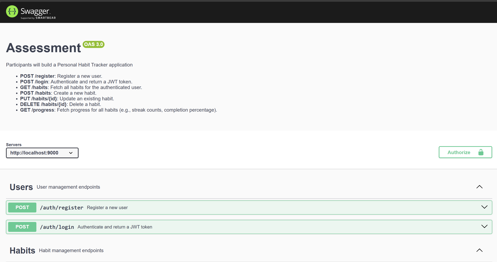

# Habit Tracker Backend Assessment

## Overview
The Personal Habit Tracker app helps users build and maintain daily habits by allowing them to set goals, track progress with streaks, earn rewards, and visualize their growth. With MongoDB for data storage and a RESTful API, users can manage habits, view charts, and set reminders to stay motivated in achieving their goals.

## Table of Contents
- [Technologies Used](#technologies-used)
- [Installation](#installation)
- [API Overview](#api-overview)
- [Swagger Documentation](#swagger-documentation)
- [License](#license)

## Technologies Used
- **Node.js**: JavaScript runtime for building scalable server-side applications
- **Express.js**: Fast, minimalist framework for Node.js, handling API routing and middleware
- **MongoDB**: NoSQL database for flexible and scalable data storage
- **Mongoose**: ODM library for MongoDB and Node.js
- **JWT (JSON Web Token)**: For secure user authentication
- **Swagger**: API documentation tool to describe the endpoints in a clear and interactive format
- **Axios**: For making HTTP requests if testing APIs within server logic

## Installation

### Prerequisites
- **Node.js** (version 18+ recommended)
- **MongoDB** installed locally or access to a MongoDB Atlas cloud database

### Steps

1. **Clone the repository**:
    ```bash
    git clone https://github.com/Akhancode/be-habitReminder-assessment.git
    ```

2. **Navigate into the project directory**:
    ```bash
    cd be-habitReminder-assessment
    ```

3. **Install dependencies**:
    ```bash
    npm install
    ```

4. **Set up environment variables**: Create a `.env` file in the root directory with the following variables:
    ```plaintext
    PORT=9000
    MONGODB_URI=mongodb://localhost:27017/your-db-name
    JWT_SECRET=your_secret_key
    ```

5. **Run the server**:
    ```bash
    npm start
    ```

6. **Access the application**: By default, the server will run on [http://localhost:3000](http://localhost:3000).

## API Overview
Here’s an overview of the main API endpoints available in this project:

Each endpoint requires specific parameters and returns a structured JSON response. Refer to the Swagger documentation for detailed information.

## Swagger Documentation
The project includes Swagger for API documentation. Access the Swagger documentation locally at [http://localhost:9000/api-docs](http://localhost:9000/api-docs).

### Screenshot


> **Note**: Ensure that `swagger-ui-express` is installed and configured in your application for the documentation to work. 


Thank you for using this project! For any questions or feedback, feel free to open an issue or contribute to the project.
